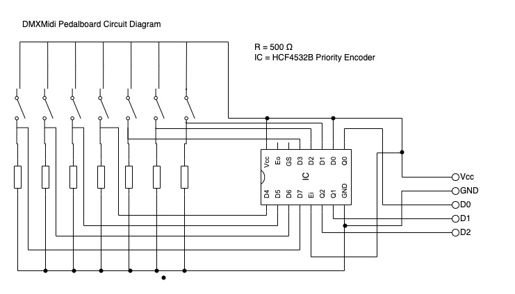

# Introduction

DMXMidi is a compact controlling software for DMX light setup for performances.

# Hardware

* Pine A64
* ST7565 LCD Display
* Pedalboard
    * 7 momentary switches
    * Pull-down resistors
    * HCF4532B 8-Bit Priority controller
    * DIN-5 connectors
    * 5-conductor cable

## Board Connections

### Pedalboard
| Pine A64 Pi-2 | Pedalboard |
|---------------|------------|
| P17 3.3V      | Vcc        |
| P25 Gnd       | GND        |
| P33 GPIO 13   | D0         |
| P35 GPIO 19   | D1         |
| P37 GPIO 26   | D2         |

### LCD Display
| Pine A64      | ST7565   |
|---------------|----------|
| P11 GPIO 17   | SI       |
| P13 GPIO 27   | CLK      |
| P15 GPIO 22   | A0       |
| P29 GPIO 6    | CS       |
| P31 GPIO 5    | RST      |
| P1 3.3V       | Vdd      |
| P9 GND        | GND      |
| P2 5V         | Anode (* |
| P6 GNF        | Kathode  |

*) Via 500 Ohm resistor

# Configuration
